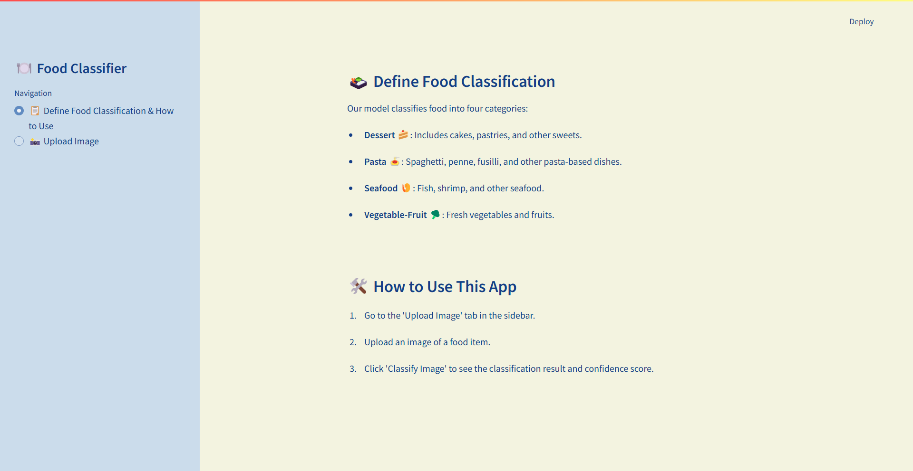
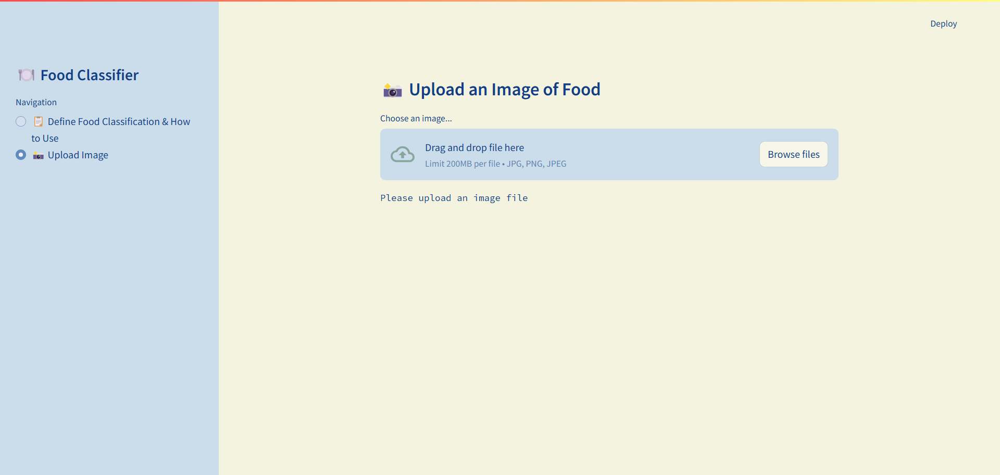

# Food Classifier 🍽️
Welcome to the Food Classification APP ‼️

This aplication uses a deep learning model to clasify images of food into four categories: Dessert, Noodles-Pasta, Seafood, and Vegetable-Fruit.
Upload an image food and click the button ***Classify Image** to see the classification result.

